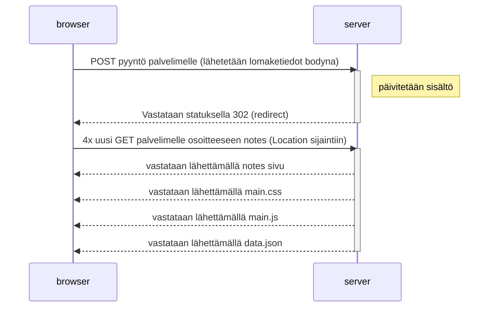

Luvussa JavaScriptia sisältävän sivun lataaminen - kertaus kuvataan sekvenssikaavion) avulla sivun https://studies.cs.helsinki.fi/exampleapp/notes avaamisen aikaansaama tapahtumasarja.

```mermaid
sequenceDiagram
    participant browser
    participant server
    
    browser->>server: POST pyyntö palvelimelle (lähetetään lomaketiedot bodyna)
    activate server
    Note right of server: päivitetään sisältö
    server-->>browser: Vastataan statuksella 302 (redirect)
    deactivate server
    
    browser->>server: 4x uusi GET palvelimelle osoitteeseen notes (Location sijaintiin)
    activate server
    server-->>browser: vastataan lähettämällä notes sivu
    server-->>browser: vastataan lähettämällä main.css
    server-->>browser: vastataan lähettämällä main.js
    server-->>browser: vastataan lähettämällä data.json
    deactivate server

```